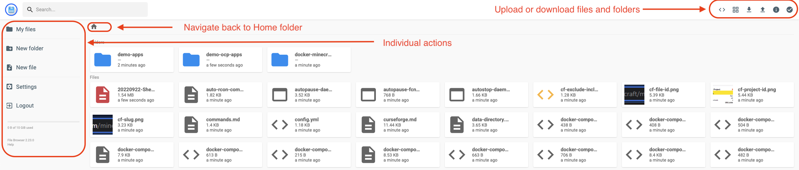

# Shared Storage (RWX) Demo Application

## Introduction

The File Browser app contained in this folder can be used to demo
how a RWX PVC can be used by applications in an IBM Storage Fusion
of Red Hat OpenShift Data Foundation enabled cluster.

The application uses:

* `quay.io/vcppds7878/filebrowser:latest` as a container image

## Building your own container image

To build your own container image:

* `cd {the directory where you cloned the repo}/filebrowser`
* `./docker_build.sh`

:exclamation: __Make sure your registry repo is accessible (public) if the OpenShift cluster does not have a specific pull-secret.__

## Deploying your application

To deploy the application and use it perform the following:

* `oc create -f ./filebrowser-cephfs.yaml`
* `oc get route -n filebrowser-rwx`
* Point your web browser to the route

You can upload files or entire folder using the UI as well as you can manually create fiels or directories.

