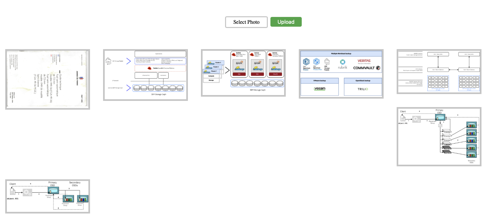

# OpenShift Container Storage Demos

## Introduction

The Photo Album app contained in this folder can be used to demo
how Object Bucket Claims can be used by applications in an IBM Storage Fusion
of Red Hat OpenShift Data Foundation enabled cluster.

The application uses:

* `https://s3.openshift-storage.svc` as an S3 endpoint
* `quay.io/vcppds7878/photo-album:latest` as a container image

## Building your own container image

To build your own container image:

# `cd {the directory where you cloned the repo}`
# `docker|podman build -t {your_image_name}:{your_tag} .`
# `docker|podman push -t {your_image_name}:{your_tag}`

:exclamation: ** Make sure your registry repo is accessible (public) if the OpenShift cluster does not have a specific pull-secret.**

## Deploying your application

To deploy the application and use it perform the following:

* `oc create -f ./photo-album-app.yaml`
* `oc get route -n photo-album`
* Point your web browser to the route

To upload a photo, click on `Select Photo`; this will open a local file selection dialog for you to
select the desired file; then click `Upload`.

:exclamation: ** Non graphic files will be uploaded but will not be rendered with a preview in the web browser. **

